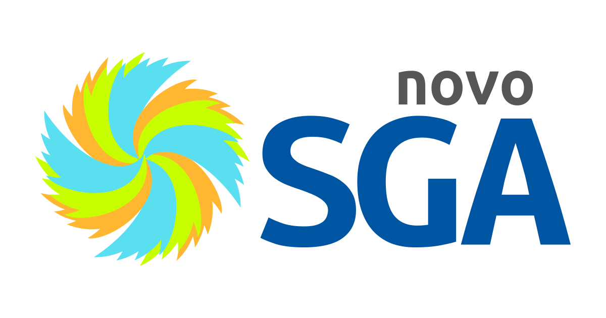
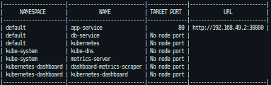
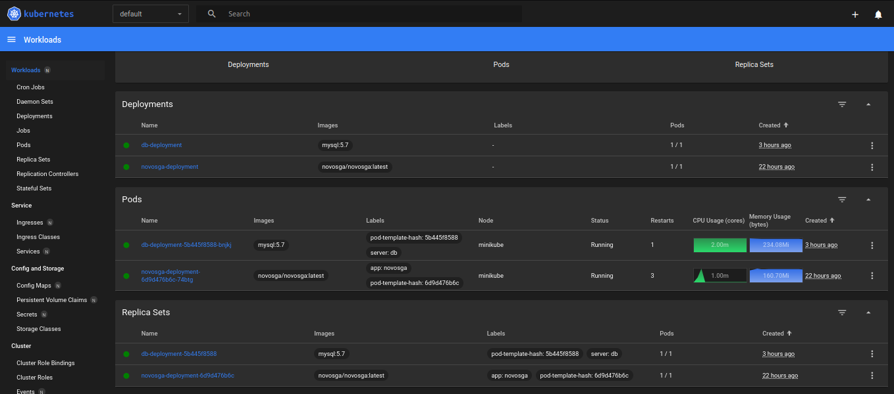

<p>
  
  
</p>

<h1 align="center"> </h1>

### Novo SGA Cluster Kubernetes

## 1 - Instalação.

### Kubectl

Kubernetes command-line tools(<a href="https://kubernetes.io/docs/tasks/tools/">kubectl</a>) permite executar comandos em seus clusters kubernetes

### Minikube

<a href='https://minikube.sigs.k8s.io/docs/start/' target="_blank">Minikube</a> é uma ferramenta que facilita o aprendizado e desenvolvimento com kubernetes de fácil instalação.

## 2 - Iniciando o cluster

`minikube start --vm-driver=docker`

<a href="https://minikube.sigs.k8s.io/docs/drivers/" target="_blank">Ver lista de drivers</a>

## 3 - Aplicando as configurações

Criar os seguintes itens:

```markdown
├── db-sga-configmap.yml
├── db-sga-deployment.yml
├── db-sga-service.yml
├── novosga-configmap.yml
├── novosga-deployment.yml
├── novosga-service.yml
```

`kubectl apply -f item`

## 4 - Acessando o NovoSGA

Para acessar a pagina do SGA é necessario fazer as seguintes configurações:

`minikube service novosga-service --url`

`minikube service list`

<p>
  
  
</p>

Acessar as URLs geradas no navegador

## 4 - Acessando o Kubernetes Dashboard

<p>
  
  
</p>

Kubernetes Dashboard é ferramenta web onde é possível criar e modificar recursos como Deployments, Jobs, Services, verificar de forma visual consumo de CPU e memoria e monitorar o estado dos pods

<a href="https://kubernetes.io/docs/tasks/access-application-cluster/web-ui-dashboard/" target="_blank">Documentação</a>

## Autor

👤 **Marcus Vinicius**

- Github: [marcusjava](https://github.com/marcusjava)
